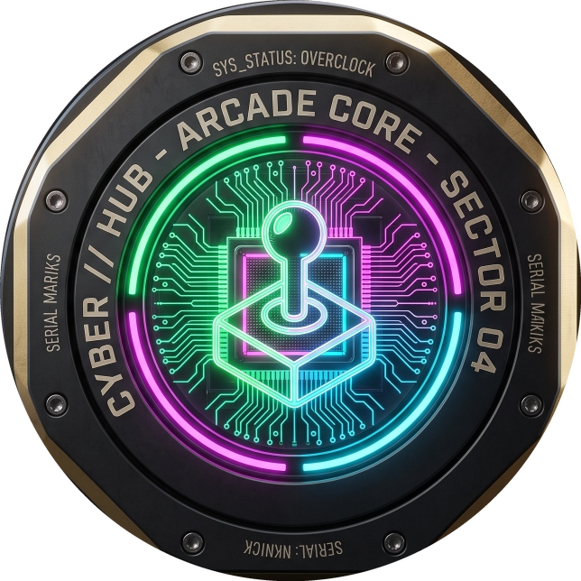

# CYBER // HUB — Neural Arcade Sprawl

<div align="center">
  
  <br>
  <h3>NETRUNNER PORTAL // SECTOR-04</h3>
  <p><b>A high-tech, low-life arcade sprawl featuring responsive browser games powered by vanilla web technologies, procedural audio synthesis, and a dark cyberpunk design system.</b></p>

  <p>
    
    
    
    
    
    
  </p>
</div>

---

## Table of Contents

- [Overview](#overview)
- [Simulation Modules (The Games)](#simulation-modules-the-games)
  - [MOD_01: Neural Sync (Memory)](#mod_01-neural-sync-memory)
  - [MOD_02: Combat Sim (Rock Paper Scissors)](#mod_02-combat-sim-rock-paper-scissors)
  - [MOD_03: Data Serpent (Snake)](#mod_03-data-serpent-snake)
  - [MOD_04: Cyber Stack (Tetris)](#mod_04-cyber-stack-tetris)
- [Design System & Visual Identity](#design-system--visual-identity)
- [Universal HUD Controls](#universal-hud-controls)
- [Controls & Input Reference](#controls--input-reference)
- [Project Architecture](#project-architecture)
- [Getting Started & Local Development](#getting-started--local-development)
- [Browser Compatibility & Responsiveness](#browser-compatibility--responsiveness)
- [License](#license)

---

## Overview

**CYBER // HUB** is an interconnected neural arcade portal designed around a futuristic netrunner aesthetic. Abandoning generic UI conventions, every component embodies the **"High-Tech, Low-Life"** cybernetic ethos:

- **Chamfered Industrial Geometries**: No standard rounded corners; every pod and HUD element uses angled digital chamfers (`clip-path`).
- **Tactical Medallion Emblems**: Custom physical engineering medallions for the hub core and each simulation protocol.
- **Dynamic CRT Scanlines**: Toggleable retro cathode-ray scanline overlay with subtle phosphorescent screen curvature.
- **Interactive Custom Reticle**: Hardware-accelerated HUD targeting cursor with corner brackets that fluidly track cursor position and expand over interactive elements.
- **Synthesized Web Audio Engine**: Integrated zero-dependency audio synthesizer using the native Web Audio API to generate real-time cybernetic blips, laser clicks, alert pulses, and victory chimes.

---

## Simulation Modules (The Games)

### MOD_01: Neural Sync (Memory)
> **Location:** `Games/Project_Memory/` | **Sector:** `NEURAL CORE // SECTOR 01`  
> **Medallion:** Half-biological, half-microprocessor Brain & Circuitry Reconstruction Unit (`#00ff88` Green Glow)

- **Objective:** Reconstruct escalating sequential neural frequencies under increasing clock speed.
- **Key Features:**
  - 4 high-voltage reactor memory nodes (Green, Red, Yellow, Blue) with luminous core flashes.
  - 3 Frequency Bandwidth Profiles:
    - `RECON`: 1000ms delay for tactical pattern recognition.
    - `TACTICAL`: 600ms standard operational clock.
    - `OVERCLOCK`: 300ms hyper-velocity cognitive reflex test.
  - Live sequence verification, failure glitch flashes, and persistent personal best (`RECORD: LVL X`) tracking.

---

### MOD_02: Combat Sim (Rock Paper Scissors)
> **Location:** `Games/Project_RPS/` | **Sector:** `TACTICAL PROTOCOL // SECTOR 02`  
> **Medallion:** Cybernetic Fist vs Hand Tactical Combat Medallion (`#ff00ff` Magenta Glow)

- **Objective:** Deploy predictive neural reflexes against rogue enemy `SENTINEL_AI` subroutines.
- **Key Features:**
  - **3D Robotic Hands on Illuminated Pedestals**:
    - `[01] ROCK`: Heavy-duty mechanical fist on a glowing neon pedestal.
    - `[02] PAPER`: Cybernetic open palm with luminous cyan circuitry traces.
    - `[03] SCISSORS`: Dual-blade titanium alloy finger chassis on an orange-lit pedestal.
  - **Engagement Thresholds**: Best of 1, Best of 3, or Best of 5 round protocols.
  - **Procedural Sentinel AI Taunts**: Dynamic contextual AI dialogue reacting to victories, losses, and frequency convergence draws.
  - **Tactical Win Streak Tracking**: Real-time streak counter with persistent high record storage.

---

### MOD_03: Data Serpent (Snake)
> **Location:** `Games/Project_Snake/` | **Sector:** `WORM INFILTRATION // SECTOR 03`  
> **Medallion:** Rainbow Pixel-Cube Snake Matrix Medallion (`#00d4ff` Cyan Glow)

- **Objective:** Pilot an autonomous worm crawler through firewall grids to harvest corrupted memory packets.
- **Key Features:**
  - Smooth HTML5 2D canvas rendering with glowing phosphorescent grid lines.
  - 3 Frequency Speeds:
    - `LOW_BANDWIDTH` (140ms clock interval)
    - `STANDARD_FREQ` (100ms clock interval)
    - `OVERCLOCK_GHZ` (60ms high-speed overclock)
  - Instant pause system with glowing `PAUSED // LINK SUSPENDED` holographic overlay.
  - Real-time score readout and persistent session memory tracking (`RECORD: [X] BYTES`).
  - **Mobile Touch Controls**: Integrated on-screen Virtual D-Pad and multi-directional capacitive touch swipe steering.

---

### MOD_04: Cyber Stack (Tetris)
> **Location:** `Games/Project_Tetris/` | **Sector:** `MEMORY DEFRAG // SECTOR 04`  
> **Medallion:** Falling Tetromino Memory Defragmentation Medallion (`#ffd700` Golden Glow)

- **Objective:** Execute high-density neural memory defragmentation by clearing falling block clusters.
- **Key Features:**
  - Real-time dedicated **Next Piece** sidebar preview canvas.
  - Accurate 7-bag piece generation, wall-kicks, and hard drop instant slam (`Spacebar` / `⤓`).
  - Pause system toggleable via `P`, `Esc`, or UI pause button with cyber overlay.
  - Persistent high score tracking stored across browser sessions.
  - Mobile tactile on-screen controls (`◀`, `↻`, `▶`, `▼`, `⤓`) for touchscreen play.

---

## Design System & Visual Identity

### Color Tokens
```css
--cyber-bg:               #0a0a0f; /* Deep Obsidian */
--cyber-card:             #12121a; /* Chamfered Pod Background */
--cyber-border:           #2a2a3e; /* Industrial Panel Borders */
--cyber-accent:           #00ff88; /* Electric Neon Green */
--cyber-accent-secondary: #ff00ff; /* Cyberpunk Hot Magenta */
--cyber-accent-tertiary:  #00d4ff; /* Laser Cyan */
--cyber-warning:          #ffd700; /* Overclock Gold / Amber */
--cyber-destructive:      #ff3366; /* Neural Breach Red */
```

### Typography
- **Headings & Badges**: `Orbitron` — Geometric, wide-tracked futuristic sans.
- **HUD Labels & Terminals**: `Share Tech Mono` — Monospaced technical display face.
- **Code & Numeric Readouts**: `JetBrains Mono` — High-legibility monospaced data font.

### Master Web Icon & Favicons
- **Master Core Medallion** (`assets/cyber-hub-icon.png`): 644×644 RGBA PNG with transparent circular antialiased boundary, gold chamfered outer bezel, and glowing neon joystick over quantum processor circuits.
- **Browser Favicons**: Standard multi-size icons for tabs (`favicon-32x32.png`, `favicon-64x64.png`), mobile web clips (`apple-touch-icon.png`), and Android PWA (`favicon-192x192.png`).

---

## Universal HUD Controls

Located in the top status bar of the Main Hub and every game screen:

1. **`[VOL: ON / OFF]` Sound Engine**:
   - Powered by `cyberpunk-system.js` via the native Web Audio API.
   - Synthesizes dynamic sound effects:
     - Card / button hover: 1200Hz cybernetic micro-blip.
     - Click / engagement: 880Hz to 220Hz downward laser pulse.
     - Success / victory: Ascending major triad chime (523Hz -> 659Hz -> 784Hz).
     - Alert / failure: Dissonant square wave alarm (180Hz / 130Hz).
   - Global mute preference is persisted in `localStorage`.

2. **`[CRT: ON / OFF]` Scanlines**:
   - Toggles the retro phosphor CRT scanline overlay.
   - When turned off, removes scanline stripes and maximizes text sharpness.
   - Preference is saved across page transitions.

3. **Persistent Record Tracking (`CyberScores`)**:
   - Automatically synchronizes personal best scores for all 4 games in browser `localStorage`.
   - Displays records on the Main Hub module chips and in-game HUDs.

---

## Controls & Input Reference

| Module | Keyboard Controls | Touch / Mobile Controls | Mouse Interaction |
| :--- | :--- | :--- | :--- |
| **Global Hub** | `Tab` / `Enter` | Tap card to launch | Custom Reticle Hover & Click |
| **Neural Sync** | Numeric keys / Click | Direct button tap | Click Reactor Nodes |
| **Combat Sim** | Number keys `1`, `2`, `3` | Tap choice cards | Click Rock / Paper / Scissors |
| **Data Serpent** | `Arrow Keys` or `W A S D`<br>`P` / `Esc` to Pause | On-screen Virtual D-Pad<br>Capacitive Swipe on canvas | Click pause button |
| **Cyber Stack** | `←` / `→` Move Left/Right<br>`↑` Rotate<br>`↓` Soft Drop<br>`Space` Hard Drop<br>`P` / `Esc` Pause | On-screen tactile buttons (`◀`, `↻`, `▶`, `▼`, `⤓`) | Click pause button |

---

## Project Architecture

```
Game_Site_Project/
├── assets/                          # Master Web Icon & Universal Favicons
│   ├── cyber-hub-icon.png           # Master 644x644 high-res circular web icon
│   ├── favicon-32x32.png            # Standard browser tab icon
│   ├── favicon-64x64.png            # High-DPI browser tab icon
│   ├── favicon-192x192.png          # Android Chrome PWA icon
│   └── apple-touch-icon.png         # iOS Web Clip icon
├── favicon.ico                      # Root fallback favicon
├── favicon.png                      # Root PNG favicon
├── index.html                       # CYBER // HUB Main Terminal
├── styles.css                       # Hub page styles & games grid
├── script.js                        # Hub logic & personal record hydration
├── cyberpunk-core.css               # Shared design system, HUD buttons, emblems & tokens
├── cyberpunk-system.js              # Web Audio API synth, score manager, CRT controller & swipe engine
├── dev_server.py                    # Local development server with no-cache headers
├── Games/
│   ├── Project_Memory/              # [MOD_01] NEURAL SYNC
│   │   ├── assets/
│   │   │   ├── memory-icon.png      # Brain & Circuitry Medallion
│   │   │   └── memory-banner.jpg    # Full workbench banner
│   │   ├── index.html
│   │   ├── styles.css
│   │   └── game.js
│   ├── Project_RPS/                 # [MOD_02] COMBAT SIM
│   │   ├── assets/
│   │   │   ├── rps-icon.png         # Fist vs Hand Combat Medallion
│   │   │   ├── rps-medallion-banner.jpg
│   │   │   ├── rock.png             # 3D Mechanical Fist on Pedestal
│   │   │   ├── paper.png            # 3D Cybernetic Palm on Pedestal
│   │   │   ├── scissors.png         # 3D Titanium Blades on Pedestal
│   │   │   ├── Point_SFX.mp3
│   │   │   └── Game_Over_SFX.mp3
│   │   ├── index.html
│   │   ├── styles.css
│   │   └── script.js
│   ├── Project_Snake/               # [MOD_03] DATA SERPENT
│   │   ├── assets/
│   │   │   ├── snake-icon.png       # Rainbow Pixel Snake Medallion
│   │   │   └── snake-banner.jpg
│   │   ├── index.html
│   │   ├── style.css
│   │   └── script.js
│   └── Project_Tetris/              # [MOD_04] CYBER STACK
│       ├── assets/
│       │   ├── tetris-icon.png      # Tetromino Defrag Medallion
│       │   └── tetris-banner.jpg
│       ├── index.html
│       ├── style.css
│       └── script.js
└── README.md
```

---

## Getting Started & Local Development

No external build steps, transpilers, or heavy frameworks are required. The project runs on standard modern browser engines.

### Method 1: Using the Included Python No-Cache Server (Recommended)
```bash
python dev_server.py
```
Then navigate to **`http://localhost:8000`** in your browser.  
*(This script sets `Cache-Control: no-cache, no-store, must-revalidate` so asset edits load immediately without stale browser cache.)*

### Method 2: Using Any Standard HTTP Server
- **Python**: `python -m http.server 8000`
- **Node.js**: `npx serve .`
- **VS Code**: Right-click `index.html` and select **"Open with Live Server"**.

---

## Browser Compatibility & Responsiveness

- **Supported Browsers**: Chrome, Edge, Firefox, Safari, Brave, Opera (latest 2 versions).
- **Responsive Viewport Testing**:
  - `4K / Ultra-wide` (2560px+)
  - `Desktop standard` (1920×1080, 1440×900, 1366×768)
  - `Tablets` (768px – 1024px iPad Portrait & Landscape)
  - `Mobile Handsets` (360px – 430px iPhone SE/14/15/Android)
- **Fluid Layout**: Uses dynamic `clamp()` typography, CSS Grid `auto-fit`, flexbox alignment, and adaptive touch controls.

---

## License

MIT License. Designed and built with the **Cyberpunk / Glitch Design System**.
